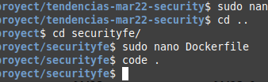
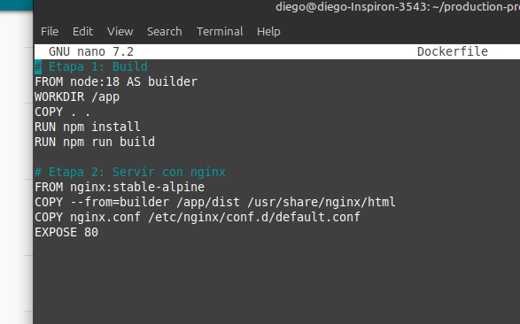
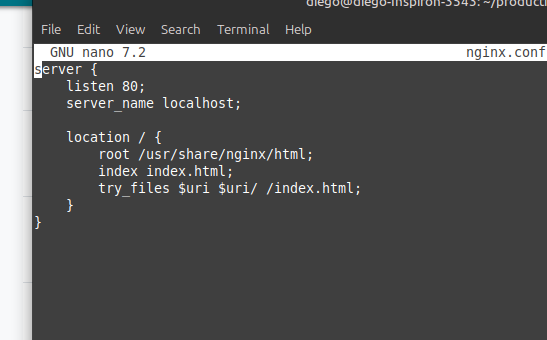
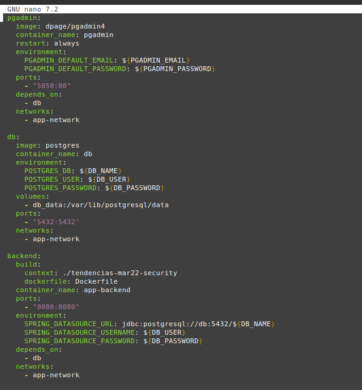
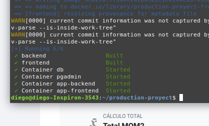
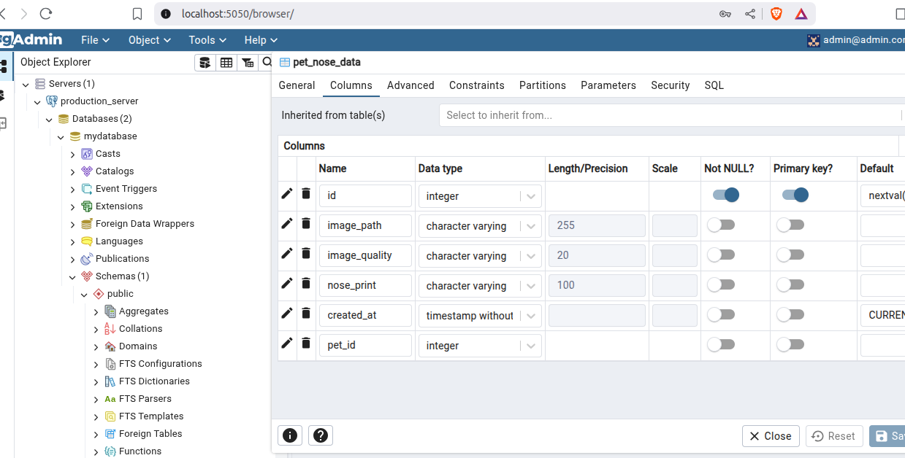
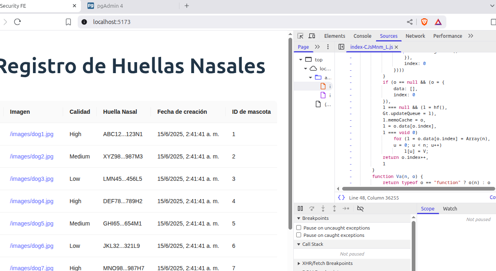

# Práctica: Semana 10
## 1. Título
**Contenerizar aplicación Frontend con React en modo producción para mostrar datos desde API**

## 2. Tiempo de duración
**30 minutos**

## 3. Fundamentos

Esta práctica puede parecer un poco redundante, pero es necesaria para identificar puntos clave en el levantamiento de contenedores orientados a un entorno de producción. Usando NGINX, podemos crear un servicio eficiente para entregar contenido estático, como los archivos compilados de una aplicación frontend (HTML, CSS, JavaScript), de manera rápida y segura.

Esta arquitectura garantiza portabilidad, facilidad de mantenimiento y un despliegue automatizado, factores esenciales para garantizar la escalabilidad y confiabilidad de aplicaciones web modernas en producción.

**Multi-stage build**

El multi-stage build es una técnica para optimizar imágenes Docker, dividiendo el proceso de construcción en múltiples etapas. Una etapa se encarga de compilar la aplicación (por ejemplo, con Node o Maven), y otra copia solo los archivos necesarios al entorno final (como NGINX o JDK). Esto reduce el tamaño de la imagen y elimina archivos innecesarios en producción.

**NGINX para producción**

NGINX actúa como un servidor web liviano y de alto rendimiento, ideal para servir aplicaciones estáticas, mejorando el tiempo de respuesta y la experiencia del usuario final. Además, su uso en conjunto con contenedores Docker y multi-stage builds permite optimizar la imagen final, eliminando archivos y dependencias innecesarias que solo se requieren durante la compilación.

**Docker compose**

Docker Compose es una herramienta que permite definir y ejecutar aplicaciones con múltiples contenedores. Facilita la gestión de servicios, redes y volúmenes mediante un único archivo YAML. Con un solo comando, es posible iniciar todos los servicios definidos. Funciona en entornos de producción, desarrollo, pruebas y flujos CI. Incluye comandos para iniciar, detener y reconstruir servicios, ver su estado y transmitir registros. También permite ejecutar comandos puntuales en un servicio (Docker, s. f.).

**Dockerfile**

Un Dockerfile es un archivo de texto que contiene un conjunto de instrucciones necesarias para construir una imagen Docker. Su propósito es automatizar el proceso de creación de entornos de ejecución, definiendo paso a paso cómo debe configurarse el sistema que contendrá la aplicación. Cada instrucción en el Dockerfile crea una nueva capa dentro de la imagen resultante.

Una imagen Docker es una plantilla inmutable que contiene todo lo necesario para ejecutar una aplicación: el sistema operativo base, el servidor o entorno de ejecución, los archivos de la aplicación y sus dependencias. Las imágenes son portables, replicables y se utilizan para lanzar contenedores, que son instancias en ejecución de dichas imágenes.

**.env**

Es un archivo de texto plano que se utiliza para almacenar variables de entorno en formato CLAVE=VALOR. Estas variables son usadas por aplicaciones para configurar su comportamiento sin necesidad de modificar el código fuente.

## 4. Conocimientos previos

- Comandos básicos de Linux.
- Instalación y uso de Docker.
- Configuración de docker-compose.yml
- Conceptos claros sobre imagenes en docker y Dockerfile.
- Comprensión de contenedores NGINX y servicios para producción

## 5. Objetivos a alcanzar

- Levantar varios contenedores a la vez
- Desplegar una aplicación full stack de forma automatizada
- Con un solo archivo yml Levantar todos los servicios y crear dos imagenes docker
- Crear una aplicacion web en formato de producción

## 6. Equipo necesario

- Computadora con sistema operativo Linux.
- Docker instalado con el plugin de docker compose.
- Acceso a internet.
- Navegador web para acceder al localhost.
- Visual Studio Code

## 7. Material de apoyo

- [Documentación oficial de Docker y Docker file](https://docs.docker.com)
- [Guía oficial de Spring Boot (Spring.io)](https://spring.io/projects/spring-boot)
- [Documentación de Docker Compose](https://docs.docker.com/compose/)
- [Archivos `.env` y uso con Docker Compose](https://docs.docker.com/compose/environment-variables/)

## 8. Procedimiento

**Nota:**

Ya que se usará el mismo Backend y Frontend pero en un medio de producción, la explicación se limitará a explicar los cambios significativos en el protecto de la semana pasada.

**Paso 1:** Copiamos la carpeta de Backend, Frontend, el docker-compose.yml y el archivo .env a una nueva carpeta de proyecto "production-proyect/" desde la carpeta del proyecto de la semana pasada.

```bash
/production-proyect$ sudo cp -r /home/diego/proyecto/securityfe .
/production-proyect$ sudo cp -r /home/diego/proyecto/tendencias-mar22-security .
/production-proyect$ sudo cp -r /home/diego/proyecto/docker-compose.yml .
```

**Paso 2:** Cambiamos el archivo Dockerfile del Frontend. Se añade "COPY nginx.conf /etc/nginx/conf.d/default.conf" que permite trabajar con una configuracion propia de NGINX. Tambien añadimos "RUN npm run build" que copila y empaqueta la aplicación.







**Paso 3:** En la raiz del proyecto Frontend creamos el archivo de configuración para NGINX "nginx.conf"



**Paso 4:** En Dockefile definimos como se va a construir cada imagen basados en el Backend de maven kotlin y en el Frontend eb React Vite


**Paso 5:** Se configuró el archivo docker‑compose.yml para orquestar múltiples contenedores, como en la semana pasada, pero ahora se desglosan de forma más clara las rutas para evitar los problemas anteriores. Además:

1. Ante solo se tenía build: ./securityfe, que le decía a Compose “usa el Dockerfile por defecto” en esa carpeta. Ahora se tiene desglosado en context y dockerfile para dejar claro que vamos a usar esa receta de dos etapas (Node → NGINX) que definimos en securityfe/Dockerfile.

2. Se realiza un mapeo de puertos orientado a NGINX como el puerto 80 interno de NGINX al 5173 externo.

3. Con el enfoque de producción, ya no e monta volúmenes para el frontend, todo el código se copia en la imagen en build‑time y se sirve estático.

4. El frontend, al servirse con NGINX, ya no necesita el mismo tipo de proxy CORS que antes, ahora se comunica con el backend vía red Docker app-network usando los nombres de servicio de backend, y no via URLs locales directas.


NOTA. Poco legible por el tamaño del archivo, mejor revizar en comandos.txt

**Resultado 1:** Verificamos que todos los contenedores y servicios se levantaron correctamente



**Resultado 2:** Vemos en el Localhost:8080 que PGADMIN se conecta correctamente con la base de datos con el puerto 5432 y las credenciales de .env



**Resultado 2:** Por último, y lo más importante: abrimos la aplicación web en http://localhost:5173. Aunque la interfaz parece igual, si vamos a Inspeccionar → Recursos → index.js, veremos que el código ahora es muy diferente; está más ilegible, sin variables ni nombres claros. A este estado se le conoce como “minificado”, y es un claro indicativo de que la aplicación se ha levantado en modo producción.



## 10. Bibliografía

Docker. (n.d.). Dockerfile reference. Docker Documentation. https://docs.docker.com/reference/dockerfile/

Docker Inc. (2024). *Docker Documentation*. https://docs.docker.com  

Guamán, M. (s.f.). Semana 8: Despliegue proyecto backend. Notion. https://wobbly-zephyr-621.notion.site/Semana-8-Despliegue-proyecto-backend-1f7a42399a818028b39ef841339a573f

López Magaña, L. M. (2019, 26 de noviembre). Cómo configurar CORS en mi API Rest con Spring Boot. OpenWebinars. Recuperado el 8 de junio de 2025, de https://openwebinars.net/blog/como-configurar-cors-en-mi-api-rest-con-spring-boot/

Molnar, N. A. (2022, diciembre 19). Despliegue de aplicaciones con Docker-Compose. Adictos al trabajo. https://adictosaltrabajo.com/2022/12/19/despliegue-de-aplicaciones-con-docker-compose/

